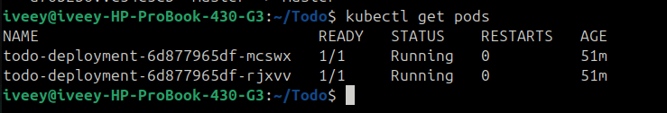
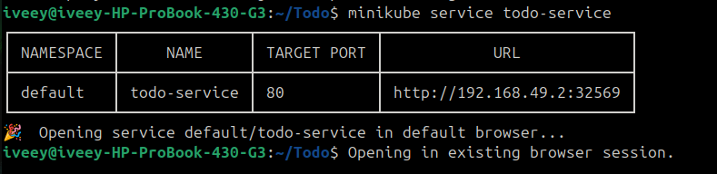
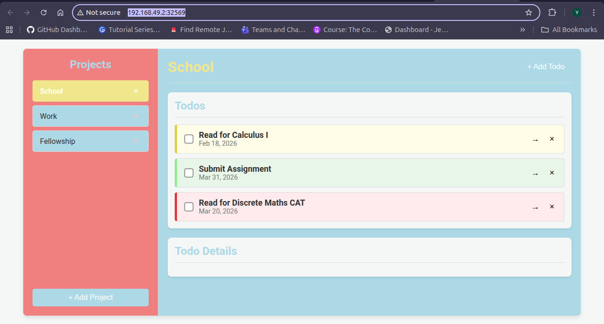

# ToDo - Web App

This project demonstrates how a simple frontend application can be containerized, orchestrated, and deployed using modern DevOps tools.  
While the application itself is intentionally simple, the focus of this project is **infrastructure, orchestration, and CI/CD**, not application complexity.

---

## Project Goal

The goal of this project is to showcase:
- Docker containerization
- Kubernetes orchestration concepts
- CI/CD automation using Jenkins
- Production-style deployment patterns (Services, Ingress, ConfigMaps)
- Infrastructure-as-Code awareness

This reflects real-world DevOps responsibilities rather than frontend feature complexity.

---

##  Tech Stack

### Application
- JavaScript (Webpack-based frontend)
- Static build output served via **Nginx**

### DevOps 
- **Docker** – containerization
- **Kubernetes (Minikube)** – local orchestration (AKS-compatible)
- **Jenkins** – CI/CD pipeline definition
- **Terraform** – AKS infrastructure definition (not applied)
- **NGINX Ingress Controller** – HTTP routing

---

## Docker Architecture

The application uses a **multi-stage Docker build**:

1. **Build stage (Node.js)**  
   - Installs dependencies
   - Builds the frontend assets using Webpack
2. **Runtime stage (Nginx)**  
   - Serves the compiled static files from `/dist`
   - Keeps the final image lightweight and secure

This pattern mirrors production level frontend deployments.

---

## Kubernetes Architecture

Even though this is a small application, it is deployed using Kubernetes to demonstrate orchestration maturity.

### Kubernetes Resources

| Resource     | Purpose |
|--------------|--------|
| Deployment   | Manages pods, replicas, rolling updates |
| Pod          | Runs the Nginx container |
| Service      | Exposes pods internally and externally |
| ConfigMap    | Stores environment configuration |
| Ingress      | HTTP routing via hostname |

---

### Service Types

This project uses a `NodePort` Service in Minikube for local access.

In a managed Kubernetes environment (AKS):
- `ClusterIP` + Ingress would be used
- Or `LoadBalancer` for direct external exposure

---

##  Ingress & Networking

An **Ingress Controller** is used to expose the application via HTTP:

- Host-based routing (`todo.local`)
- Cleaner than exposing NodePorts directly
- Mirrors production traffic flow

Local hostname resolution is handled via `/etc/hosts` for development.

---

## CI/CD Pipeline (Jenkins)

The repository includes a Jenkins pipeline definition:

### Pipeline Stages
1. **Build Docker Image**
2. **Deploy to Kubernetes**

The Jenkinsfile mirrors the manually validated deployment steps and is designed to run in an automated CI environment.

> Jenkins is not executed locally in this project; the pipeline is included to demonstrate CI/CD design and workflow understanding.

---

##  Terraform & AKS (Infrastructure as Code)

A Terraform configuration for **Azure Kubernetes Service (AKS)** is included for demonstration purposes.

- Defines AKS cluster and node pool
- Not applied due to inactive Azure subscription
- Kubernetes manifests are cloud-agnostic and AKS-ready

---

##  Why Kubernetes Is Overkill Here 

For a simple To-Do app, Kubernetes is not strictly necessary.

However, Kubernetes is used here to demonstrate:
- Orchestration concepts
- Deployment strategies
- Networking patterns
- Production-readiness thinking
  
---

##  Future Improvements

- Push Docker image to a container registry
- Deploy to AKS using Terraform
- Add Horizontal Pod Autoscaling (HPA)
- Use Helm for Kubernetes packaging
- Add monitoring (Prometheus/Grafana)

---

## Author

**Yvette Christine**  
DevOps / Cloud Engineering Portfolio Project

## Deployment Evidence

### Kubernetes Pods Running

### Kubernetes Service Exposed

### Application Running in Browser

